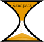

# Zandpack (version 1.0)
[](https://www.mozilla.org/en-US/MPL/2.0/)





# Introduction
Zandpack is an open-source Python package for performing time-dependent quantum transport calculations using the Auxiliary Mode Expansion (AME) method. Built on Non-Equilibrium Green’s Function (NEGF) theory, Zandpack enables simulations of open quantum systems (e.g., devices coupled to electrodes) evolving under time-dependent biases and fields. The code is designed to interface with regular tight-binding models, SIESTA, DFTB+ or any LCAO-based DFT code, allowing for dynamic electronic effects in the device region. The code propagates the driven Heisenberg equation for the density matrix

$\frac{\mathrm{d}\sigma}{\mathrm{d}t} = [H(t), \sigma(t)] + i\sum_\alpha\left[\Pi_\alpha(t) + \Pi_\alpha^\dagger(t) \right]$. 

and allows for numerically exact open-system dynamics at the mean-field level. See the [publication](https://doi.org/10.1016/j.cpc.2026.110087) for the full details.


## Features 
 - Easy handling of the steady-state TranSIESTA and TBtrans calculations using the siesta_python code
 - Auxiliary Mode Expansion (AME): Uses a level-width function expanded in Lorentzian functions, with algorithms ensuring positive semidefinite fits.
 -  Command line tools for determininng both steady-state steady state and the system evolving under external fields:
       - The SCF tool for obtaining the steady-state density matrix.
       - The psinought tool for obtaining the steady state auxiliary mode wave-vectors.
       - The zand code to propagate the full initial state under timedependent bias and fields. This part is implemented using mpi4py and can scale to many compute nodes. 
 - Extensible: Supports custom interfaces for other LCAO-based DFT codes.

## Installation
To install Zandpack, download the code as a zip file, unpack it and navigate to the Zandpack folder containing the setup.py file in a terminal. Now execute
```console
    python3 -m pip install -e .
```
and you will have an editable install of the code. 

Additionally, add the these two folders to your PATH environment variable: 
```console
   export PATH="/YOUR/PATH/TO/Zandpack/Zandpack/cmdtools:$PATH"
   export PATH="/YOUR/PATH/TO/Zandpack/Zandpack/mpi:$PATH"
```
Zandpack depends on the following packages: 
- numpy
- numba
- scipy
- sisl
- psutil
- joblib 
- matplotlib
- siesta_python
- Block_matrices
- Gf_Module

The [Block matrices](https://github.com/AleksBL/Block_TD_block_sparse), [Gf_Module](https://github.com/AleksBL/gfunc_Module) and [siesta_python](https://github.com/AleksBL/siesta_python) codes can be found on GitHub https://github.com/AleksBL and are installed analogously to this code (download and pip install...).


## Documentation
A html file can be found (after you build it) in the docs/_build/html directory. This containes additional information about the code usage and structure. 

## Demonstration of use
You can find a demonstration of the use of Zandpack on the [here](https://gnulinux.tube/w/dLTgJsfmDSCk2ggop9uUw9) for the Zandpack/examples/C60 calculation. 

## Tutorials
Tutorials are available as introductory notebooks. Navigate to into the second Zandpack folder and copy the notebooks from there into a directory where you wish to run your calculations (Desktop or other). Other example calculations will also be made public here at some point. 

## Examples
Python scripts of several example calculations can be found in the examples folder. These are less structured, but they are undestandable after doing the tutorials. 

## Contact 
Users can get in contact with the developer by submitting an issue on the Zandpack Github page. You also direct messages to aleksander.bl@proton.me.
## Licence
Zandpack is released under the Mozilla Public License v2.0. See the LICENCE file in the Zandpack directory.

